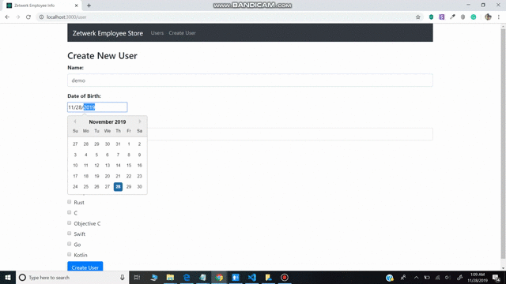

# zetwerk-task

#Features completed:
1. Create Employee details with Employee id, Name, Date of birth, Salary and Skills (multiple checkboxes).
2. Employee list page
3. Update Employee details
4. Delete Employee information.
5. Autogenerating employee id.

#Features pending:

1. Option to upload Employee photo
2. Validate inputs
3. Deployment of a code on a public server 
4. Employee list pagination
5. Employee list search
6. Adding comments to the code.
7. Adding test cases
8. Improving UI

# Website Overview

